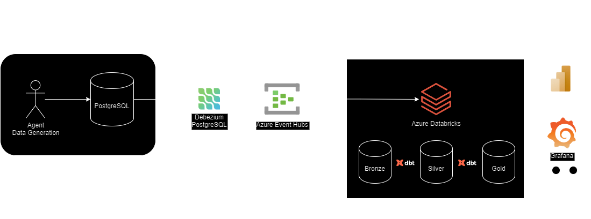

# Ecommerce Analytics - Data Engineering Project

An end-to-end data engineering project for an ecommerce company, enabling automatic report generation and near real-time analysis.

The data used in this project is generated by a simulated agent Python script, based on the [Brazilian E-Commerce Public Dataset by Olist](https://www.kaggle.com/datasets/olistbr/brazilian-ecommerce).

### 1. Project Architecture Overview

The data pipeline architecture used in this project starts with Debezium PostgreSQL Connector, capturing all data changes in Postgres database tables. As the changes occur, Debezium connector automatically sends the changes as stream events to Azure Event Hubs. The streams of data changes are consumed by Apache Spark Structured Streaming in Azure Databricks.

With the assistance of Unit Catalog from Databricks, we built a [Medallion Architecture](https://www.databricks.com/glossary/medallion-architecture) containing three layers: bronze, silver and gold. The bronze layer contains the raw data and it suposes to be synchronized with the tables on the source. With DBT models, the raw data is labeled, transformed and modeled composing the silver layer. The gold layer includes aggregated historical data for analysis and data serving.

The image below gives an overview of the entire data workflow.

#





### 2. Used Tools and Technologies

- Python
- Apache Spark
  - Spark Structured Streaming
  - Spark SQL
- Azure Databricks
  - Unit Catalog
  - Delta Tables
- Azure Event Hubs (Kafka Protocol)
- DBT (Data Build Tool)
- Docker
- Git / Github

### 3. Running Locally

The architecture of this project was planned with Azure Cloud Services in mind, but the source database and data generation scripts can be executed locally.

**Pre requesites**

First clone the repository from Github.

```
git clone https://github.com/IgorTrevelin/ecommerce-analytics.git && cd ecommerce-analytics
```

Make a copy of .env.example file and rename it to .env. Also, its advised to change its values for better security.

```
cp ./.env.example ./.env
```

Now run all the required services with docker-compose.

```
docker compose up -d && ./init.sh
```

This will run a PostgreSQL instance, a database initialization script and the agent script that will run indefinitely until manual interruption.

### 4. Authors Social Medias

- Igor Trevelin:
    - [LinkedIn](https://www.linkedin.com/in/igor-trevelin/)
    - [Github](https://github.com/IgorTrevelin)
- Vitor Trevelin:
    - [Github](https://github.com/VitorTrevelin)